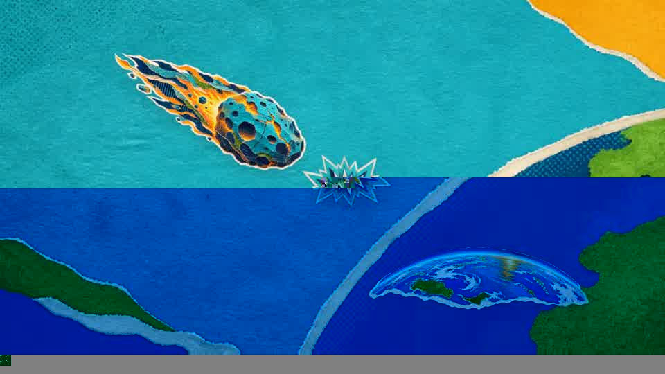

# paper-collage-video-windows

面向 Windows 新手的纸艺拼贴视频 Codex Skill。它把环境检查、分镜、中文配音、Remotion 渲染、音乐混合和成片验收整理成一套可重复使用的流程。

[](./恐龙灭绝-完整成片-配音加音乐-无音效.mp4)

> 点击恐龙封面观看完整成片：1920×1080，中文男声配音加背景音乐，无音效。

## 主要能力

- 检查 Node.js、npm、Python、FFmpeg、ffprobe 和 Edge TTS
- 处理 `npm.ps1` 被 PowerShell 执行策略拦截的问题
- 规划纸艺拼贴风格的旁白、分镜和透明 PNG 素材
- 使用 Remotion 制作 16:9 横屏视频
- 生成中文男声配音并混合背景音乐
- 检查 MP4 是否同时包含 H.264 视频和 AAC 音频
- 排查视频无声、音乐太小和文件无法播放等问题

## 安装

在 Codex 中安装这个 GitHub Skill：

```text
https://github.com/zyrlu08-droid/paper-collage-video-windows
```

也可以让 Codex 执行：

```text
请把 https://github.com/zyrlu08-droid/paper-collage-video-windows
安装到我的个人技能目录。
```

安装后完全退出并重新打开 Codex。

## 调用

在 Codex 对话中输入：

```text
$paper-collage-video-windows

请先检查运行环境。我是新手，如果缺少配置，请一步一步告诉我怎么处理，暂时不要开始生成视频。
```

准备制作视频时，可以输入：

```text
$paper-collage-video-windows

视频主题：恐龙是怎么灭绝的
画面比例：16:9
制作方式：remotion-code
配音：中文男声
时长：15 秒
请先制作分镜，等我确认后再生成素材。
```

## 项目结构

```text
paper-collage-video-windows/
├─ SKILL.md
├─ agents/openai.yaml
├─ scripts/check_windows_video_env.ps1
├─ references/windows-troubleshooting.md
├─ references/audio-and-export.md
├─ preview.jpg
└─ 恐龙灭绝-完整成片-配音加音乐-无音效.mp4
```

## 环境快速检查

```powershell
powershell -ExecutionPolicy Bypass -File .\scripts\check_windows_video_env.ps1
```

检查成功时会显示 Node、npm、Python、FFmpeg、ffprobe 和 Edge TTS 的版本。

## 示例说明

仓库中的示例视频展示了本 Skill 的一次完整实际制作过程，包括：纸张纹理、撕边拼贴、分层运动、中文男声旁白、背景音乐，以及兼容播放器的 H.264/AAC 导出。

欢迎 Fork、学习和改进。

